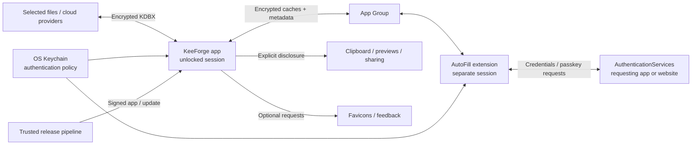

# KeeForge threat model

## Overview

This is the maintained, high-level threat model for KeeForge on iPhone, iPad, and macOS, including its AutoFill extensions and distribution channels. It describes security objectives, existing controls, and limitations to consider when changing the product. The scenarios below are review hypotheses, not confirmed vulnerabilities or evidence of a completed security audit. Vulnerability reporting and scope remain governed by [SECURITY.md](../SECURITY.md); detailed Mac constraints live in [KeeForgeMac/SECURITY.md](../KeeForgeMac/SECURITY.md).

KeeForge opens user-selected or cloud-hosted KeePass databases, decrypts them locally, and returns encrypted KDBX bytes to storage. KDBX 4.x supports editing; KDBX 3.1 is read-only. Users can unlock with a password and/or key file, use an authenticated saved unlock key, and, on supported iOS hardware, require a YubiKey challenge response. AutoFill runs in a separate process with access to shared encrypted caches and Keychain items. It can also save credentials, including passkey registrations, so it is part of the write boundary.

| Component | Responsibility and source anchors |
| --- | --- |
| App session | Unlock, editing, save policy, and lock lifecycle: [KeeForge/ViewModels/DatabaseViewModel.swift:1025](../KeeForge/ViewModels/DatabaseViewModel.swift#L1025), [lock:1965](../KeeForge/ViewModels/DatabaseViewModel.swift#L1965). |
| Database engine | File validation, key derivation, encryption, and parsing: [KeeForge/Models/KDBXParser.swift:243](../KeeForge/Models/KDBXParser.swift#L243), [KDBX3Parser.swift:56](../KeeForge/Models/KDBX3Parser.swift#L56), [EncryptedValue.swift:22](../KeeForge/Models/EncryptedValue.swift#L22). |
| Persistence and sync | Local baseline checks and backups; remote revision checks and encrypted uploads: [KeeForge/Services/Persistence/LocalDatabaseSaver.swift:240](../KeeForge/Services/Persistence/LocalDatabaseSaver.swift#L240), [KeeForge/Services/Cloud/CloudDatabaseSaver.swift:163](../KeeForge/Services/Cloud/CloudDatabaseSaver.swift#L163). |
| AutoFill | Credential selection, passkey matching, credential creation, and cleanup: [AutoFillExtension/CredentialProviderCoordinator.swift:1663](../AutoFillExtension/CredentialProviderCoordinator.swift#L1663), [registration:2116](../AutoFillExtension/CredentialProviderCoordinator.swift#L2116), [cleanup:2358](../AutoFillExtension/CredentialProviderCoordinator.swift#L2358). |
| Platform and release integration | Keychain, OS credential store, clipboard, previews, network services, and direct-Mac updates; concrete boundaries are below. |

Arrows describe data flows, not blanket trust. Cloud storage and imported files are untrusted inputs. The OS mediates authentication, entitlements, and requesting-site identity; KeeForge owns credential selection, session handling, and encrypted writes.

### Resources and deployment differences

Paths below are relative to the OS-resolved container, not fixed device paths. They describe production behavior. Injected unit tests instead use `<temporary directory>/KeeForgeUnitTestAppGroup/group.com.keevault.shared` and the `group.com.keevault.shared.unit-tests` defaults suite. In production, failure to resolve the group directory falls back to the process temporary directory; defaults independently fall back to standard defaults if the suite is unavailable ([AppGroupContainer.swift:28](../KeeForge/Services/Persistence/AppGroupContainer.swift#L28)). Neither fallback guarantees app/extension sharing.

| Deployment or workflow | Resource or capability | Configuration and precedence | Safe effective value or location | Readers, writers, or recipients | Enforcing control | Evidence or unknowns |
| --- | --- | --- | --- | --- | --- | --- |
| All apps and extensions | Encrypted caches, database references, backups, upload queue | Entitled App Group; temporary-directory fallback if unavailable | `group.com.keevault.shared`: `database-list.json`, `databases/<database UUID>.kdbx`, `cloud-cache/<sanitized provider-account>/<SHA256(file ID)>.kdbx`, `Library/Application Support/backups/<database UUID>/`, `pending-uploads/<database UUID>/<marker UUID>.json` | App and extension; local processes with filesystem authority | OS container access plus KDBX encryption; metadata is outside vault encryption | [AppGroupContainer.swift:31](../KeeForge/Services/Persistence/AppGroupContainer.swift#L31), [DatabaseListStore.swift:19](../KeeForge/Services/Persistence/DatabaseListStore.swift#L19), [cache paths:1301](../KeeForge/Services/Persistence/DatabaseListStore.swift#L1301), [PendingUploadQueue.swift:407](../KeeForge/Services/Cloud/PendingUploadQueue.swift#L407). Fallback storage does not establish successful cross-process sharing. |
| Quick unlock | Composite key, or pre-key for a hardware-key database | First Keychain access group; per-database item | Team-prefixed `com.keevault.sharedkeychain`, service `com.keevault.app` | App and extension, subject to item authentication | Data Protection Keychain, `WhenUnlockedThisDeviceOnly`, current biometrics; Mac item also allows an authorized Apple Watch | [KeychainService.swift:14](../KeeForge/Services/Security/KeychainService.swift#L14), [item creation:90](../KeeForge/Services/Security/KeychainService.swift#L90), [hardware-key unlock:1025](../KeeForge/ViewModels/DatabaseViewModel.swift#L1025). Mac AutoFill's authentication flow remains biometric-only. |
| Cloud sync | Stored provider credentials | `CloudKeychainAccessGroup` from build settings; default Keychain group if absent | Shared group; service `com.keevault.cloud-token.<provider>` | Entitled app-family code; intended consumer is app sync | `AfterFirstUnlockThisDeviceOnly`; no vault-unlock or biometric gate on these items | [CloudTokenStore.swift:9](../KeeForge/Services/Cloud/CloudTokenStore.swift#L9), [query:62](../KeeForge/Services/Cloud/CloudTokenStore.swift#L62), [project.yml:118](../project.yml#L118), [Mac setting:189](../project.yml#L189). SDK-managed OAuth caches have their own policies. |
| iOS optional icons and account metadata | Plaintext domain/account metadata | Shared container and defaults | `<App Group>/favicons`; App Group cloud-account defaults | App family; requested domains go to `icons.duckduckgo.com` | Sandbox access; website-icon setting defaults off | [FaviconService.swift:39](../KeeForge/Services/AppSupport/FaviconService.swift#L39), [SharedVaultStore.swift:35](../KeeForge/Services/Persistence/SharedVaultStore.swift#L35), [SettingsService.swift:269](../KeeForge/Services/AppSupport/SettingsService.swift#L269). |
| macOS optional icons and account metadata | Same metadata, app-local storage | Application Support, temporary-directory fallback for icons; standard defaults for accounts | `<app Application Support>/favicons` or `<app temporary directory>/favicons`; app defaults | Main app; icon provider receives requested domains | App sandbox; Mac extension lacks outbound-network entitlement | [FaviconService.swift:57](../KeeForge/Services/AppSupport/FaviconService.swift#L57), [SharedVaultStore.swift:35](../KeeForge/Services/Persistence/SharedVaultStore.swift#L35), [AutoFillExtensionMac.entitlements:4](../AutoFillExtension/AutoFillExtensionMac.entitlements#L4). |
| Attachment preview/share | Plaintext file | Explicit preview/share action | `<process temporary directory>/attachment-previews/<UUID>/<sanitized filename>` | KeeForge, Quick Look, chosen receiving app | Sanitized names; protected writes on iOS; cleanup on dismissal/lock and orphan purge | [AttachmentPreviewFileStore.swift:14](../KeeForge/Services/AppSupport/AttachmentPreviewFileStore.swift#L14), [PlatformCompat.swift:327](../KeeForge/Extensions/PlatformCompat.swift#L327). macOS disk protection depends on the OS/FileVault; receiver copies are outside cleanup. |
| Direct Mac distribution | Install replacement application code | Direct-build overlay enables Sparkle; App Store build blanks updater settings | Embedded `SUFeedURL` and `SUPublicEDKey`; signed update payload | Installed app, Sparkle installer services, release operators | Update signatures, signing/notarization, artifact verification | [SoftwareUpdateService.swift:14](../KeeForge/Services/AppSupport/SoftwareUpdateService.swift#L14), [project-direct.yml:38](../project-direct.yml#L38), [project.yml:196](../project.yml#L196). Actual signed artifacts and embedded configuration require release-time verification. |

## Threat model, trust boundaries, and assumptions

### Assets and objectives

- **Vault confidentiality:** passwords, TOTP seeds, passkey private keys, attachments, history, notes, and custom fields should remain inaccessible without the required unlock factors. Stolen encrypted copies still permit offline password guessing; password strength and key-file custody matter.
- **Key and authentication integrity:** saved unlock keys must retain OS authentication controls. Hardware-key quick unlock must retain the hardware factor; it stores the pre-key, not the final composite key. Hardware-key transport is currently available only in the iOS app, not Mac or either extension ([HardwareKeyService.swift:8](../KeeForge/Services/Security/HardwareKeyService.swift#L8)).
- **Correct disclosure:** AutoFill should release the intended credential to the OS-mediated request, respect per-database selection, and bind passkey assertions to the relying party and allowed credential. Publishing suggestion metadata must not publish passwords or private keys. Password identities do expose domains, usernames or fallback titles, and record identifiers to the OS ([CredentialIdentityStoreManager.swift:804](../KeeForge/Services/AutoFill/CredentialIdentityStoreManager.swift#L804)).
- **Integrity and recoverability:** saves should preserve the vault, detect conflicting changes, retain encrypted backups, and avoid losing extension-created credentials during later sync. KDBX authentication detects tampering; it does not establish that a valid old copy is the newest copy.
- **Availability and privacy:** hostile files, KDF parameters, server responses, and imported content should not cause uncontrolled resource use or unintended disclosure. Logs, optional network features, and plaintext metadata must be considered separately from encrypted vault bytes.

### Actors and boundaries

The legitimate user selects databases, authorizes unlocks, chooses recipients, and configures storage. Relevant attackers may possess an encrypted vault; supply a malicious file, attachment, CSV import, or `otpauth://` link; control a cloud server or network path; operate a phishing site or requesting app; or run local software with its existing OS permissions. These capabilities do not inherently grant the vault key, biometric approval, access to another sandbox, or update-signing authority.

1. **Untrusted bytes → database engine.** Header and KDF processing precede successful authentication. KDBX 4 verifies header and payload HMACs; Argon2 has context-specific memory/work/parallelism ceilings, and decompression has an output ceiling. These are specific controls, not proof that every parser or native dependency is resource-safe ([KDBXParser.swift:309](../KeeForge/Models/KDBXParser.swift#L309), [KDF checks:615](../KeeForge/Models/KDBXParser.swift#L615), [KDFExecutionPolicy.swift:23](../KeeForge/Models/KDFExecutionPolicy.swift#L23), [KDBXCrypto.swift:540](../KeeForge/Models/KDBXCrypto.swift#L540)). KDBX 3.1 uses its legacy integrity mechanism, not KDBX 4's HMAC guarantees.
2. **Locked state → usable secrets.** Keychain authentication and database decryption gate session creation. Selected secrets are re-encrypted with a session AES-GCM key. Completed lock clears keys, parsed contents, drafts, attachment references, and preview files. Unsaved editors or drafts can defer that transition indefinitely: a requested lock is not a completed lock ([DatabaseViewModel.swift:1965](../KeeForge/ViewModels/DatabaseViewModel.swift#L1965), [lock deferral:2021](../KeeForge/ViewModels/DatabaseViewModel.swift#L2021)).
3. **App ↔ AutoFill ↔ requesting client.** The extension has its own session and cleanup. Shared storage is a collaboration surface, not isolation between mutually distrusting app-family processes. The Mac extension has neither network nor external-file access entitlements; shared bookmark code does not grant those capabilities. Passkey registration saves before reporting success. The OS is trusted to supply the requesting context; KeeForge must still match the appropriate database, entry, and relying party.
4. **Session → durable storage or cloud.** Local writes compare a SHA-512 baseline and back up encrypted bytes. Cloud writes add provider revision checks. AutoFill writes encrypted cache bytes and pending-upload metadata for the app to drain, recording a durable provisional marker before saving and finalizing its payload hash afterward ([AutoFillSaveCoordinator.swift:149](../KeeForge/Services/AutoFill/AutoFillSaveCoordinator.swift#L149)). These controls reduce accidental conflicts; they are not a trusted global revision ledger against a malicious storage provider.
5. **Vault → display, clipboard, preview, or network recipient.** Copying and sharing intentionally release plaintext. Optional favicon lookup discloses domains to DuckDuckGo; feedback submits the user's message, diagnostic details, and optional contact/photo to `feedback.keeforge.com`. A user-supplied message or screenshot can itself contain secrets ([FaviconView.swift:45](../KeeForge/Views/Components/FaviconView.swift#L45), [FeedbackSubmissionService.swift:110](../KeeForge/Services/AppSupport/FeedbackSubmissionService.swift#L110)).
6. **Source and release infrastructure → trusted executable.** Dependencies, build tooling, signing credentials, Apple distribution, and direct-update signing/publication are trusted supply-chain inputs. A malicious update could execute with the app's legitimate access to unlocked secrets. Artifact checks must preserve sandboxing, Hardened Runtime, and channel-specific update configuration ([ci_scripts/verify_mac_artifact.sh:97](../ci_scripts/verify_mac_artifact.sh#L97), [channel checks:215](../ci_scripts/verify_mac_artifact.sh#L215)). Direct Mac builds additionally grant access to Sparkle installer Mach services `com.keevault.app-spks` and `com.keevault.app-spki`; those exceptions do not belong in App Store builds ([KeeForgeMacDirect.entitlements:49](../KeeForgeMac/KeeForgeMacDirect.entitlements#L49)).

### Assumptions, limitations, and open questions

- The OS, Keychain, authentication UI, cryptographic implementations, and signed release are trusted. Root/kernel compromise or unrestricted inspection of an unlocked process defeats this model. The [reporting policy](../SECURITY.md#scope) excludes jailbroken-device requirements, physical access to an unlocked device, third-party-service vulnerabilities, and weaknesses intrinsic to KDBX.
- Session encryption does not conceal all in-memory content: arbitrary protected custom fields and unrecognized XML can retain plaintext, and Swift/framework copies cannot all be reliably erased. The [Mac security model](../KeeForgeMac/SECURITY.md#secrets-in-memory) records these shared limitations.
- Screen-capture blocking on Mac is best effort, not a boundary against Screen Recording or Accessibility permission. Mac clipboard concealment is advisory; its clear timer cannot survive termination and cannot prevent Universal Clipboard. iOS uses local-only, expiring pasteboard items. Preview deletion is not secure erasure, and receiving apps may retain copies ([ClipboardService.swift:22](../KeeForge/Services/AppSupport/ClipboardService.swift#L22), [Mac clipboard:51](../KeeForge/Services/AppSupport/ClipboardService.swift#L51), [Mac screen privacy](../KeeForgeMac/SECURITY.md#screen-and-clipboard-privacy)).
- Network protection depends on the selected provider. WebDAV requires HTTPS by default, allows explicit HTTP opt-in, and refuses cross-origin redirects. FTP uses plaintext TCP, exposing its login and traffic metadata to the network; KDBX encryption protects vault contents, not transport credentials. FTP also lacks atomic conditional writes ([WebDAVModels.swift:60](../KeeForge/Services/Cloud/WebDAVModels.swift#L60), [WebDAVClient.swift:342](../KeeForge/Services/Cloud/WebDAVClient.swift#L342), [FTPClient.swift:102](../KeeForge/Services/Cloud/FTPClient.swift#L102), [transport:462](../KeeForge/Services/Cloud/FTPClient.swift#L462), [FTPCloudProvider.swift:177](../KeeForge/Services/Cloud/FTPCloudProvider.swift#L177)).
- Current code enables WebDAV and FTP on Mac, with Dropbox and OneDrive additionally available on iOS. Older summaries in `KeeForge/README.md` and `KeeForge/Services/README.md` mention only WebDAV on Mac; [CloudSyncModels.swift:60](../KeeForge/Services/Cloud/CloudSyncModels.swift#L60) and the maintained Mac security document include FTP.
- This source-based model does not verify deployed server settings, installed entitlements, dependency vulnerabilities, release-key custody, or all parser resource bounds. Those require targeted validation when the corresponding boundary changes. A valid encrypted file can still be stale or contain hostile content supplied by someone who knows its key.

## Attack surface, mitigations, and attacker stories

Priority indicates review order by potential impact and reachability, not a finding severity. Existing limitations above are established behavior; failures proposed below are hypotheses. “Mitigation” describes what to preserve or verify, not a claim that a new safeguard has already shipped.

| Priority | Scenario and capability gain | Prerequisites | Impact | Existing controls | Mitigation | Evidence |
| --- | --- | --- | --- | --- | --- | --- |
| 1 | A hostile vault header or authenticated payload drives excessive computation, parser failure, or code execution | User opens attacker-controlled bytes; authenticated payload attacks generally require a valid vault/key | Denial of access; potentially session compromise if an exploitable memory-safety failure exists | Header/block authentication, Argon2 policy, decompression ceiling | Review pre-authentication work separately; test bounds and native parser/crypto dependencies | [KDBXParser.swift:309](../KeeForge/Models/KDBXParser.swift#L309), [KDFExecutionPolicy.swift:23](../KeeForge/Models/KDFExecutionPolicy.swift#L23), [KDBXCrypto.swift:540](../KeeForge/Models/KDBXCrypto.swift#L540) |
| 1 | A requesting site/app receives another credential or a passkey assertion for the wrong relying party | Reachable AutoFill flow plus failed selection/authentication checks | Account takeover | Per-database opt-in, session unlock, RP/credential-ID matching, cleanup | Preserve request binding across selection, database switches, cancellation, and authentication callbacks | [Coordinator:1005](../AutoFillExtension/CredentialProviderCoordinator.swift#L1005), [RP checks:1663](../AutoFillExtension/CredentialProviderCoordinator.swift#L1663), [cleanup:2358](../AutoFillExtension/CredentialProviderCoordinator.swift#L2358) |
| 1 | Saved-key access or a stale session bypasses the intended unlock boundary | Access to an exposed app/extension path; OS authorization must not simply be assumed | Vault disclosure | Authenticated device-only Keychain items; lock and cleanup clear session references | Verify every completion after lock/cancellation; retain the hardware factor; describe deferred locks accurately | [KeychainService.swift:90](../KeeForge/Services/Security/KeychainService.swift#L90), [DatabaseViewModel.swift:1965](../KeeForge/ViewModels/DatabaseViewModel.swift#L1965) |
| 1 | Attacker-supplied application code is accepted as a release/update | Compromised dependency/build/release authority or a verification bypass | Broad credential compromise after users unlock | Code signing, hardened artifacts, direct-update signature verification, publication bound to artifact hashes | Protect signing authority and review release/dependency changes; verify exact distributed artifacts | [SoftwareUpdateService.swift:14](../KeeForge/Services/AppSupport/SoftwareUpdateService.swift#L14), [verify_mac_artifact.sh:97](../ci_scripts/verify_mac_artifact.sh#L97), [release_direct_artifact.sh:318](../ci_scripts/release_direct_artifact.sh#L318) |
| 2 | Storage replacement, rollback, or competing app/extension saves lose credentials or overwrite changes | Provider/file write access or concurrent writers | Integrity and availability loss | Local baselines, encrypted backups, provider revisions, pending-upload payload hashes | Exercise interrupted and conflicting writes; preserve backups; do not claim rollback resistance or FTP compare-and-swap | [LocalDatabaseSaver.swift:273](../KeeForge/Services/Persistence/LocalDatabaseSaver.swift#L273), [CloudDatabaseSaver.swift:174](../KeeForge/Services/Cloud/CloudDatabaseSaver.swift#L174), [PendingUploadQueue.swift:16](../KeeForge/Services/Cloud/PendingUploadQueue.swift#L16) |
| 2 | Network observer steals provider credentials or a hostile endpoint redirects them | FTP, explicitly enabled HTTP, or a transport/control failure | Cloud-account access and encrypted-vault theft/replacement | HTTPS default and same-origin redirects for WebDAV; vault encryption remains independent | Use authenticated encrypted transport for untrusted networks; keep plaintext modes and endpoint choices explicit | [WebDAVModels.swift:60](../KeeForge/Services/Cloud/WebDAVModels.swift#L60), [WebDAVClient.swift:342](../KeeForge/Services/Cloud/WebDAVClient.swift#L342), [FTPClient.swift:462](../KeeForge/Services/Cloud/FTPClient.swift#L462) |
| 2 | Plaintext or keys escape through shared files, logs, previews, or another local app | An unintended write/disclosure, or OS access to an intentional plaintext output | Secret or sensitive-metadata exposure | Encrypted caches/exports, Keychain, preview cleanup, clipboard expiry/clearing, platform privacy controls | Keep secrets out of metadata/logs; audit new shared writers and output lifetimes; minimize plaintext retention | [DatabaseExportService.swift:23](../KeeForge/Services/Persistence/DatabaseExportService.swift#L23), [AttachmentPreviewFileStore.swift:21](../KeeForge/Services/AppSupport/AttachmentPreviewFileStore.swift#L21), [ClipboardService.swift:22](../KeeForge/Services/AppSupport/ClipboardService.swift#L22) |
| 3 | Imported credentials or an enrollment link mislead the user, consume resources, or replace unintended data | User imports a CSV or follows an `otpauth://` link | Incorrect credentials or enrollment; local denial of service | Import-size ceiling; enrollment replacement decision; normal draft/save flow | Preserve explicit destination/replacement decisions and input validation; remember source CSV remains plaintext | [PasswordImport.swift:83](../KeeForge/Models/PasswordImport.swift#L83), [TOTPEnrollmentViewModel.swift:101](../KeeForge/ViewModels/TOTPEnrollmentViewModel.swift#L101) |
| 3 | Optional services or credential suggestions disclose more metadata than intended | Icons/AutoFill enabled or feedback submitted | Domain, account, or user-content privacy loss | Icons default off, explicit feedback flow, metadata-only credential identities | Keep opt-in and payload boundaries clear; review actual fields and recipients when adding diagnostics | [SettingsService.swift:269](../KeeForge/Services/AppSupport/SettingsService.swift#L269), [FeedbackSubmissionService.swift:143](../KeeForge/Services/AppSupport/FeedbackSubmissionService.swift#L143), [CredentialIdentityStoreManager.swift:804](../KeeForge/Services/AutoFill/CredentialIdentityStoreManager.swift#L804) |

## Severity calibration (Critical, High, Medium, Low)

Severity applies to a validated failure with a demonstrated trust-boundary crossing. Impact, reachability, confidence, and missing evidence should be recorded separately.

| Severity | Example if validated | What would reduce or invalidate that assessment |
| --- | --- | --- |
| Critical | A broadly reachable update-verification bypass or remote exploit that enables large-scale extraction of unlocked vault secrets | Control of the already-trusted release-signing environment is a different prerequisite; replacing an appcast alone does not establish a signature bypass. |
| High | Authentication bypass releasing vault contents, cross-RP passkey use, or exploitable code execution from a vault opened through an ordinary supported flow | The attacker must gain access they did not already have. Inspecting an already-compromised unlocked process is not evidence of a new KeeForge boundary failure. |
| Medium | Attacker-triggered recoverable vault unavailability, meaningful metadata leakage beyond the selected feature, or a write race that loses data under realistic conditions | Scope, required user actions, recoverability, and backups matter. A conflict correctly refused by the saver is a successful control. |
| Low | Limited unintended non-secret disclosure or a minor security-relevant behavior with constrained impact | Authorized copying, expected optional favicon disclosure, and documented platform behavior alone are not vulnerabilities. |

Maintain this model when unlock factors, shared storage, provider transports, AutoFill authority, plaintext outputs, or distribution trust change. Keep detailed platform contracts next to their implementation and historical audit results in `docs/audits/`.
