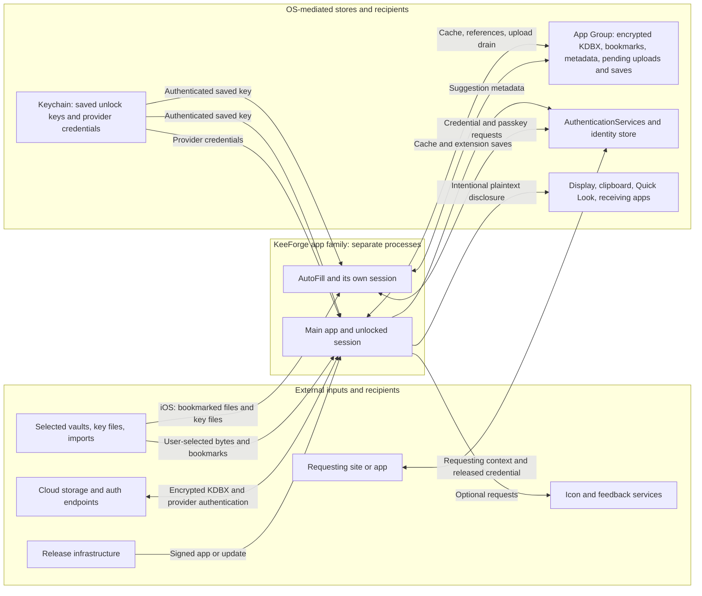

# KeeForge threat model

## Overview

This is the maintained threat model for KeeForge on iPhone, iPad, and macOS, including its AutoFill extensions and distribution channels. Start with the assets and boundary invariants below when changing the product; the resource inventory records implementation details. The scenarios are review hypotheses, not confirmed vulnerabilities or evidence of a completed security audit. Vulnerability reporting is governed by [SECURITY.md](../SECURITY.md); detailed Mac constraints live in [KeeForgeMac/SECURITY.md](../KeeForgeMac/SECURITY.md).

KeeForge opens user-selected or cloud-hosted KeePass databases, decrypts them locally, and returns encrypted KDBX bytes to storage. KDBX 4.x supports editing; KDBX 3.1 is read-only. Users can unlock with a password and/or key file, use an authenticated saved unlock key, and, on supported iOS hardware, require a YubiKey challenge response. AutoFill runs in a separate process with access to shared encrypted caches and Keychain items. It can also save credentials, including passkey registrations, so it is part of the write boundary.

| Component | Responsibility and source anchors |
| --- | --- |
| App session | Unlock, editing, save policy, and lock lifecycle: [KeeForge/ViewModels/DatabaseViewModel.swift:1036](../KeeForge/ViewModels/DatabaseViewModel.swift#L1036), [lock:1978](../KeeForge/ViewModels/DatabaseViewModel.swift#L1978). |
| Database engine | File validation, key derivation, encryption, and parsing: [KeeForge/Models/KDBXParser.swift:243](../KeeForge/Models/KDBXParser.swift#L243), [KDBX3Parser.swift:56](../KeeForge/Models/KDBX3Parser.swift#L56), [EncryptedValue.swift:22](../KeeForge/Models/EncryptedValue.swift#L22). |
| Persistence and sync | Local baseline checks and backups; remote revision checks and encrypted uploads: [KeeForge/Services/Persistence/LocalDatabaseSaver.swift:269](../KeeForge/Services/Persistence/LocalDatabaseSaver.swift#L269), [KeeForge/Services/Cloud/CloudDatabaseSaver.swift:163](../KeeForge/Services/Cloud/CloudDatabaseSaver.swift#L163). |
| AutoFill | Credential selection, passkey matching, credential creation, and cleanup: [AutoFillExtension/CredentialProviderCoordinator.swift:1666](../AutoFillExtension/CredentialProviderCoordinator.swift#L1666), [registration:2120](../AutoFillExtension/CredentialProviderCoordinator.swift#L2120), [cleanup:2362](../AutoFillExtension/CredentialProviderCoordinator.swift#L2362). |
| Platform and release integration | Keychain, OS credential store, clipboard, previews, network services, Mac quick search, and direct-Mac updates; concrete boundaries are below. |

Arrows mark data or authority crossings, not blanket trust. Cloud storage, imported files, and requesting clients are untrusted. The OS mediates authentication, entitlements, and requesting-client identity; KeeForge owns credential selection, session handling, and encrypted writes. The Mac extension cannot use the app's external-file or network entitlements, so its file arrow is iOS-only: what it saves for a file-backed database stays in the App Group until the app writes it to the file.

## Threat model, trust boundaries, and assumptions

### Assets and objectives

- **Vault confidentiality:** passwords, TOTP seeds, passkey private keys, attachments, history, notes, and custom fields should remain inaccessible without the required unlock factors. Stolen encrypted copies still permit offline password guessing; password strength and key-file custody matter.
- **Key and authentication integrity:** saved unlock keys must retain OS authentication controls. Hardware-key quick unlock must retain the hardware factor; it stores the pre-key, not the final composite key. Hardware-key transport is currently available only in the iOS app, not Mac or either extension ([HardwareKeyService.swift:8](../KeeForge/Services/Security/HardwareKeyService.swift#L8)).
- **Correct disclosure:** AutoFill should release the intended credential to the OS-mediated request, respect per-database selection, and bind passkey assertions to the relying party and allowed credential. Publishing suggestion metadata must not publish passwords or private keys. Password identities do expose domains, usernames or fallback titles, and record identifiers to the OS ([CredentialIdentityStoreManager.swift:804](../KeeForge/Services/AutoFill/CredentialIdentityStoreManager.swift#L804)).
- **Integrity and recoverability:** saves should preserve the vault, detect conflicting changes, retain encrypted backups, and avoid losing extension-created credentials during later sync. KDBX 4.x authenticates its header and payload, but even a valid copy can be stale. KDBX 3.1 has no authenticated outer header and checks its decrypted block stream with unkeyed SHA-256 hashes ([KDBX3Parser.swift:78](../KeeForge/Models/KDBX3Parser.swift#L78), [hashed blocks:160](../KeeForge/Models/KDBX3Parser.swift#L160)).
- **Availability and privacy:** hostile files, KDF parameters, server responses, and imported content should not cause uncontrolled resource use or unintended disclosure. Logs, optional network features, and plaintext metadata must be considered separately from encrypted vault bytes.

### Actors and boundaries

The legitimate user selects databases, authorizes unlocks, chooses recipients, and configures storage. Relevant attackers may possess an encrypted vault; supply a malicious file, key file, attachment, CSV import, or incoming URL; control a cloud server or network path; operate a phishing site or requesting app; or run local software with its existing OS permissions. These capabilities do not inherently grant the vault key, biometric approval, access to another sandbox, or update-signing authority. Reporting-policy exclusions do not erase the corresponding product and privacy boundaries.

| Crossing | Invariant and enforcing control | Limitation or review focus |
| --- | --- | --- |
| Untrusted vault bytes → database engine | Bound pre-authentication work; verify KDBX 4.x header and block HMACs before using authenticated content. Argon2 has context-specific memory, work, and parallelism ceilings, and decompression has an output ceiling ([KDBXParser.swift:309](../KeeForge/Models/KDBXParser.swift#L309), [KDF checks:615](../KeeForge/Models/KDBXParser.swift#L615), [KDFExecutionPolicy.swift:23](../KeeForge/Models/KDFExecutionPolicy.swift#L23), [KDBXCrypto.swift:540](../KeeForge/Models/KDBXCrypto.swift#L540)). | KDBX 3.1 has different integrity checks; parser and native-dependency resource safety is not established by these limits. |
| Selected vault or key file → app and extension | Associate each file with the intended database. `database-list.json` contains database and key-file bookmarks, not their file bytes ([DatabaseReference.swift:7](../KeeForge/Models/DatabaseReference.swift#L7), [DatabaseListStore.swift:705](../KeeForge/Services/Persistence/DatabaseListStore.swift#L705)). | A bookmark is sensitive access metadata, subject to OS capabilities. iOS AutoFill may follow selected-file and key-file bookmarks; Mac AutoFill has no external-file entitlement and uses the encrypted cache ([Coordinator:1317](../AutoFillExtension/CredentialProviderCoordinator.swift#L1317), [file read:1391](../AutoFillExtension/CredentialProviderCoordinator.swift#L1391), [Mac entitlements](../AutoFillExtension/AutoFillExtensionMac.entitlements)). |
| Locked state and saved key → usable session | Keychain authentication and database decryption gate session creation; hardware-key quick unlock retains the hardware factor. Selected secrets are sealed with a session AES-GCM key. A completed lock clears that key, parsed contents, drafts, attachment references, and preview files ([KeychainService.swift:90](../KeeForge/Services/Security/KeychainService.swift#L90), [EncryptedValue.swift:22](../KeeForge/Models/EncryptedValue.swift#L22), [DatabaseViewModel.swift:1978](../KeeForge/ViewModels/DatabaseViewModel.swift#L1978)). | Unsaved editors or drafts can defer a requested lock indefinitely ([lock deferral:2035](../KeeForge/ViewModels/DatabaseViewModel.swift#L2035)); session encryption does not cover every plaintext copy. |
| App and AutoFill → OS credential broker → requesting site or app | The extension has its own session; KeeForge must bind selection to the enabled database, entry, and relying party. Passkey registration saves before success; published suggestion identities carry metadata, not secrets ([Coordinator:1008](../AutoFillExtension/CredentialProviderCoordinator.swift#L1008), [RP match:1666](../AutoFillExtension/CredentialProviderCoordinator.swift#L1666), [identity publication:813](../KeeForge/Services/AutoFill/CredentialIdentityStoreManager.swift#L813)). | The OS supplies requesting context. Shared storage and Keychain authority make app and extension collaborators, not mutually isolated principals. Check cancellation, database switches, and cleanup. |
| Unlocked session → local file, App Group, or cloud | Local writes check an open-time SHA-512 baseline and back up encrypted bytes. Cloud writes check provider revisions where the provider supports an effective conditional write. AutoFill persists a provisional upload marker before saving and finalizes its payload hash afterward. The Mac extension saves a file-backed database to the shared copy and keeps the saved bytes as a pending local save; the app merges that into its unlocked session and writes the file through the same baseline-checked local save ([PendingLocalSaveStore.swift:17](../KeeForge/Services/Persistence/PendingLocalSaveStore.swift#L17), [DatabaseViewModel.swift:2881](../KeeForge/ViewModels/DatabaseViewModel.swift#L2881), [LocalDatabaseSaver.swift:302](../KeeForge/Services/Persistence/LocalDatabaseSaver.swift#L302), [CloudDatabaseSaver.swift:174](../KeeForge/Services/Cloud/CloudDatabaseSaver.swift#L174), [AutoFillSaveCoordinator.swift:150](../KeeForge/Services/AutoFill/AutoFillSaveCoordinator.swift#L150)). | This is not a global rollback ledger. FTP has no atomic conditional write; OneDrive session uploads above 4 MiB check `If-Match` at session creation, leaving a concurrent-write window before commit ([FTPCloudProvider.swift:177](../KeeForge/Services/Cloud/FTPCloudProvider.swift#L177), [OneDriveCloudProvider.swift:682](../KeeForge/Services/Cloud/OneDriveCloudProvider.swift#L682)). |
| Incoming iOS URL → cloud authentication or vault action | Route Dropbox and OneDrive OAuth callbacks to their provider handlers before interpreting `otpauth://` or database URLs; a callback must belong to its initiated authentication and intended account ([KeeForgeApp.swift:574](../KeeForge/App/KeeForgeApp.swift#L574), [CloudProviderRegistry.swift:52](../KeeForge/Services/Cloud/CloudProviderRegistry.swift#L52)). | Callback validation is delegated to the provider SDKs and needs targeted review when authentication changes. Mac ships neither OAuth provider nor callback scheme. |
| Unlocked session → display, clipboard, preview, or network recipient | Explicit copying and sharing release plaintext. Mac quick search reads the active unlocked session from a non-activating panel; password copy prompts for device-owner authentication and rechecks the session, while username and verification-code copy do not ([MacQuickSearchViewModel.swift:91](../KeeForge/ViewModels/MacQuickSearchViewModel.swift#L91), [copy:171](../KeeForge/ViewModels/MacQuickSearchViewModel.swift#L171)). | Mac screen-capture and clipboard controls are best effort. Optional icons disclose domains to DuckDuckGo; feedback sends user content and optional contact/photo to `feedback.keeforge.com` ([FaviconView.swift:45](../KeeForge/Views/Components/FaviconView.swift#L45), [FeedbackSubmissionService.swift:110](../KeeForge/Services/AppSupport/FeedbackSubmissionService.swift#L110)). |
| Source and release infrastructure → installed executable | Dependencies, signing, Apple distribution, and direct-update signing/publication must yield the intended signed artifact with sandboxing and Hardened Runtime ([verify_mac_artifact.sh:97](../ci_scripts/verify_mac_artifact.sh#L97), [channel checks:215](../ci_scripts/verify_mac_artifact.sh#L215)). | Direct Mac builds add Sparkle installer Mach-service exceptions that must not enter App Store builds ([KeeForgeMacDirect.entitlements:49](../KeeForgeMac/KeeForgeMacDirect.entitlements#L49)). A malicious accepted update can access unlocked secrets. |

### Assumptions, limitations, and open questions

- The OS, Keychain, authentication UI, cryptographic implementations, and signed release are trusted. Root/kernel compromise or unrestricted inspection of an unlocked process defeats these controls. The [vulnerability reporting policy](../SECURITY.md#scope) has separate scope exclusions; those exclusions do not remove ordinary unlocked-device disclosure, cloud-provider behavior, or KDBX-version differences from design review.
- Session encryption does not conceal all in-memory content: arbitrary protected custom fields and unrecognized XML can retain plaintext, and Swift/framework copies cannot all be reliably erased. The [Mac security model](../KeeForgeMac/SECURITY.md#secrets-in-memory) records these shared limitations.
- Screen-capture blocking on Mac is best effort, not a boundary against Screen Recording or Accessibility permission. Mac clipboard concealment is advisory; its clear timer cannot survive termination and cannot prevent Universal Clipboard. iOS uses local-only, expiring pasteboard items. Preview deletion is not secure erasure, and receiving apps may retain copies ([ClipboardService.swift:22](../KeeForge/Services/AppSupport/ClipboardService.swift#L22), [Mac clipboard:51](../KeeForge/Services/AppSupport/ClipboardService.swift#L51), [Mac screen privacy](../KeeForgeMac/SECURITY.md#screen-and-clipboard-privacy)).
- Network protection depends on the selected provider. WebDAV requires HTTPS by default, allows explicit HTTP opt-in, and refuses cross-origin redirects. FTP uses plaintext TCP, exposing its login and traffic metadata to the network; KDBX encryption protects vault contents, not transport credentials ([WebDAVModels.swift:60](../KeeForge/Services/Cloud/WebDAVModels.swift#L60), [WebDAVClient.swift:342](../KeeForge/Services/Cloud/WebDAVClient.swift#L342), [FTPClient.swift:102](../KeeForge/Services/Cloud/FTPClient.swift#L102)).
- Cloud conflict protection differs by provider. FTP lacks atomic conditional writes. OneDrive overwrites above 4 MiB use upload sessions whose `If-Match` check occurs at session creation rather than commit, leaving a window for a concurrent remote write to be replaced ([FTPCloudProvider.swift:177](../KeeForge/Services/Cloud/FTPCloudProvider.swift#L177), [OneDriveCloudProvider.swift:682](../KeeForge/Services/Cloud/OneDriveCloudProvider.swift#L682)).
- A cloud database may open a cached copy when its sync policy is manual or the provider is unavailable. Successful KDBX authentication establishes that the copy has not failed its format integrity checks, not that it is the newest remote copy ([CloudSyncCoordinator.swift:60](../KeeForge/Services/Cloud/CloudSyncCoordinator.swift#L60)).
- Current code enables WebDAV and FTP on Mac, with Dropbox and OneDrive additionally available on iOS. Older summaries in `KeeForge/README.md` and `KeeForge/Services/README.md` mention only WebDAV on Mac; [CloudSyncModels.swift:60](../KeeForge/Services/Cloud/CloudSyncModels.swift#L60) and the maintained Mac security document include FTP.
- This source-based model does not verify deployed server settings, installed entitlements, dependency vulnerabilities, release-key custody, or all parser resource bounds. Those require targeted validation when the corresponding boundary changes. A valid encrypted file can still be stale or contain hostile content supplied by someone who knows its key.

### Effective resource inventory

Container paths below are relative to the OS-resolved location, not fixed device paths. They describe production behavior. Injected unit tests instead use `<temporary directory>/KeeForgeUnitTestAppGroup/group.com.keevault.shared` and the `group.com.keevault.shared.unit-tests` defaults suite. In production, failure to resolve the group directory falls back to the process temporary directory; defaults independently fall back to standard defaults if the suite is unavailable ([AppGroupContainer.swift:28](../KeeForge/Services/Persistence/AppGroupContainer.swift#L28)). Neither fallback guarantees app/extension sharing.

| Deployment and resource | Effective location or configuration | Access and enforcing control | Evidence and limitation |
| --- | --- | --- | --- |
| App Group caches and metadata | `group.com.keevault.shared`: `database-list.json`, `databases/<database UUID>.kdbx`, `cloud-cache/<sanitized provider-account>/<SHA256(file ID)>.kdbx`, `Library/Application Support/backups/<database UUID>/`, `pending-uploads/<database UUID>/<marker UUID>.json`, and `pending-local-saves/<database UUID>/<UTC timestamp>.kdbx`. | App and extension share the container. KDBX protects vault contents; references, bookmarks, and upload metadata remain outside vault encryption. | [AppGroupContainer.swift:31](../KeeForge/Services/Persistence/AppGroupContainer.swift#L31), [DatabaseListStore.swift:19](../KeeForge/Services/Persistence/DatabaseListStore.swift#L19), [cache paths:1316](../KeeForge/Services/Persistence/DatabaseListStore.swift#L1316), [PendingUploadQueue.swift:407](../KeeForge/Services/Cloud/PendingUploadQueue.swift#L407). Temporary-directory fallback does not establish cross-process sharing. |
| Selected vault and key-file bookmarks | `DatabaseReference.bookmarkData` and `keyFileBookmarkData` are encoded in the shared database list. The selected files themselves remain at their OS- or provider-resolved locations. | The main app resolves both; iOS AutoFill can use supported security-scoped access. Mac AutoFill lacks the external-file entitlement and normally reads the shared encrypted cache. | [DatabaseReference.swift:7](../KeeForge/Models/DatabaseReference.swift#L7), [DatabaseListStore.swift:705](../KeeForge/Services/Persistence/DatabaseListStore.swift#L705), [Coordinator:1317](../AutoFillExtension/CredentialProviderCoordinator.swift#L1317), [file read:1391](../AutoFillExtension/CredentialProviderCoordinator.swift#L1391). A bookmark is access metadata, not a copy of the key file. |
| Saved quick-unlock key | Per-database item in the first team-prefixed `com.keevault.sharedkeychain` Keychain group, service `com.keevault.app`. Hardware-key databases store a pre-key rather than the final composite key. | App and extension can request an item subject to Data Protection Keychain `WhenUnlockedThisDeviceOnly` and current biometric policy. Mac app items also allow an authorized Apple Watch; Mac AutoFill's calling policy remains biometric-only. | [KeychainService.swift:14](../KeeForge/Services/Security/KeychainService.swift#L14), [item creation:90](../KeeForge/Services/Security/KeychainService.swift#L90), [hardware-key unlock:1036](../KeeForge/ViewModels/DatabaseViewModel.swift#L1036). |
| Cloud provider credentials | `CloudKeychainAccessGroup` from build settings, or the default Keychain group if absent; service `com.keevault.cloud-token.<provider>`. | Entitled app-family code can access these `AfterFirstUnlockThisDeviceOnly` items without a vault-unlock or biometric gate; the intended consumer is app sync. SDK-managed OAuth caches have separate policies. | [CloudTokenStore.swift:9](../KeeForge/Services/Cloud/CloudTokenStore.swift#L9), [query:62](../KeeForge/Services/Cloud/CloudTokenStore.swift#L62), [iOS setting:118](../project.yml#L118), [Mac setting:189](../project.yml#L189). |
| iOS OAuth callback | App URL schemes for Dropbox and OneDrive return through `onOpenURL` to provider handlers before other link routing. Mac declares no corresponding schemes. | The OS delivers the URL; provider SDKs receive it and are expected to validate the authentication callback. KeeForge must preserve its association with the initiated provider/account flow. | [KeeForgeApp.swift:305](../KeeForge/App/KeeForgeApp.swift#L305), [routing:574](../KeeForge/App/KeeForgeApp.swift#L574), [CloudProviderRegistry.swift:52](../KeeForge/Services/Cloud/CloudProviderRegistry.swift#L52), [iOS Info.plist:13](../KeeForge/Info.plist#L13). |
| iOS optional icons and account metadata | `<App Group>/favicons` and App Group cloud-account defaults. | App family can read this plaintext metadata; requested domains go to `icons.duckduckgo.com`. Website icons default off. | [FaviconService.swift:39](../KeeForge/Services/AppSupport/FaviconService.swift#L39), [SharedVaultStore.swift:35](../KeeForge/Services/Persistence/SharedVaultStore.swift#L35), [SettingsService.swift:269](../KeeForge/Services/AppSupport/SettingsService.swift#L269). |
| Mac optional icons and account metadata | `<app Application Support>/favicons`, with temporary-directory fallback, and app-local defaults for accounts. | Main app can use these resources. Mac AutoFill has no outbound-network entitlement. | [FaviconService.swift:57](../KeeForge/Services/AppSupport/FaviconService.swift#L57), [SharedVaultStore.swift:35](../KeeForge/Services/Persistence/SharedVaultStore.swift#L35), [Mac extension entitlements](../AutoFillExtension/AutoFillExtensionMac.entitlements). |
| Mac menu bar quick search | Optional non-activating panel and global shortcut; settings live in app defaults, off by default. No separate vault cache. | Reads the active unlocked session. Password copy has a device-owner prompt and session recheck; username and verification-code copies do not. Screen-capture blocking remains best effort. | [MacQuickAccessController.swift:26](../KeeForge/Services/AppSupport/MacQuickAccessController.swift#L26), [MacQuickSearchViewModel.swift:91](../KeeForge/ViewModels/MacQuickSearchViewModel.swift#L91), [copy:171](../KeeForge/ViewModels/MacQuickSearchViewModel.swift#L171), [Mac security model](../KeeForgeMac/SECURITY.md#menu-bar-quick-search). |
| Attachment preview or share | `<process temporary directory>/attachment-previews/<UUID>/<sanitized filename>`. | KeeForge writes plaintext for Quick Look or a chosen receiving app. iOS uses protected writes; dismissal, lock, and launch cleanup remove local files. | [AttachmentPreviewFileStore.swift:14](../KeeForge/Services/AppSupport/AttachmentPreviewFileStore.swift#L14), [PlatformCompat.swift:327](../KeeForge/Extensions/PlatformCompat.swift#L327). Mac disk protection depends on the OS/FileVault; receiver copies are outside cleanup. |
| Direct Mac update | Direct-build overlay embeds `SUFeedURL` and `SUPublicEDKey`; App Store builds blank updater settings. | Installed app, Sparkle installer services, and release operators handle the signed update. Signatures, signing/notarization, and artifact verification enforce the intended channel. | [SoftwareUpdateService.swift:14](../KeeForge/Services/AppSupport/SoftwareUpdateService.swift#L14), [project-direct.yml:38](../project-direct.yml#L38), [project.yml:196](../project.yml#L196). Installed artifact configuration requires release-time verification. |

## Attack surface, mitigations, and attacker stories

Priority indicates review order by potential impact and reachability, not a finding severity. Existing limitations above are established behavior; failures proposed below are hypotheses. “Mitigation” describes what to preserve or verify, not a claim that a new safeguard has already shipped.

| Priority | Scenario and capability gain | Prerequisites | Impact | Existing controls | Mitigation | Evidence |
| --- | --- | --- | --- | --- | --- | --- |
| 1 | A hostile vault header or authenticated payload drives excessive computation, parser failure, or code execution | User opens attacker-controlled bytes; authenticated payload attacks generally require a valid vault/key | Denial of access; potentially session compromise if an exploitable memory-safety failure exists | Header/block authentication, Argon2 policy, decompression ceiling | Review pre-authentication work separately; test bounds and native parser/crypto dependencies | [KDBXParser.swift:309](../KeeForge/Models/KDBXParser.swift#L309), [KDFExecutionPolicy.swift:23](../KeeForge/Models/KDFExecutionPolicy.swift#L23), [KDBXCrypto.swift:540](../KeeForge/Models/KDBXCrypto.swift#L540) |
| 1 | A requesting site/app receives another credential or a passkey assertion for the wrong relying party | Reachable AutoFill flow plus failed selection/authentication checks | Account takeover | Per-database opt-in, session unlock, RP/credential-ID matching, cleanup | Preserve request binding across selection, database switches, cancellation, and authentication callbacks | [Coordinator:1008](../AutoFillExtension/CredentialProviderCoordinator.swift#L1008), [RP checks:1666](../AutoFillExtension/CredentialProviderCoordinator.swift#L1666), [cleanup:2362](../AutoFillExtension/CredentialProviderCoordinator.swift#L2362) |
| 1 | Saved-key access or a stale session bypasses the intended unlock boundary | Access to an exposed app/extension path; OS authorization must not simply be assumed | Vault disclosure | Authenticated device-only Keychain items; lock and cleanup clear session references | Verify every completion after lock/cancellation; retain the hardware factor; describe deferred locks accurately | [KeychainService.swift:90](../KeeForge/Services/Security/KeychainService.swift#L90), [DatabaseViewModel.swift:1978](../KeeForge/ViewModels/DatabaseViewModel.swift#L1978) |
| 1 | Attacker-supplied application code is accepted as a release/update | Compromised dependency/build/release authority or a verification bypass | Broad credential compromise after users unlock | Code signing, hardened artifacts, direct-update signature verification, publication bound to artifact hashes | Protect signing authority and review release/dependency changes; verify exact distributed artifacts | [SoftwareUpdateService.swift:14](../KeeForge/Services/AppSupport/SoftwareUpdateService.swift#L14), [verify_mac_artifact.sh:97](../ci_scripts/verify_mac_artifact.sh#L97), [release_direct_artifact.sh:318](../ci_scripts/release_direct_artifact.sh#L318) |
| 2 | Storage replacement, rollback, or competing app/extension saves lose credentials or overwrite changes | Provider/file write access or concurrent writers | Integrity and availability loss | Local baselines, encrypted backups, supported provider revision checks, pending-upload payload hashes | Exercise interrupted and conflicting writes; preserve backups; do not claim rollback resistance, FTP compare-and-swap, or commit-time revision protection for OneDrive session uploads above 4 MiB | [LocalDatabaseSaver.swift:302](../KeeForge/Services/Persistence/LocalDatabaseSaver.swift#L302), [CloudDatabaseSaver.swift:174](../KeeForge/Services/Cloud/CloudDatabaseSaver.swift#L174), [OneDriveCloudProvider.swift:682](../KeeForge/Services/Cloud/OneDriveCloudProvider.swift#L682) |
| 2 | Network observer steals provider credentials or a hostile endpoint redirects them | FTP, explicitly enabled HTTP, or a transport/control failure | Cloud-account access and encrypted-vault theft/replacement | HTTPS default and same-origin redirects for WebDAV; vault encryption remains independent | Use authenticated encrypted transport for untrusted networks; keep plaintext modes and endpoint choices explicit | [WebDAVModels.swift:60](../KeeForge/Services/Cloud/WebDAVModels.swift#L60), [WebDAVClient.swift:342](../KeeForge/Services/Cloud/WebDAVClient.swift#L342), [FTPClient.swift:462](../KeeForge/Services/Cloud/FTPClient.swift#L462) |
| 2 | Plaintext or keys escape through shared files, logs, previews, or another local app | An unintended write/disclosure, or OS access to an intentional plaintext output | Secret or sensitive-metadata exposure | Encrypted caches/exports, Keychain, preview cleanup, clipboard expiry/clearing, platform privacy controls | Keep secrets out of metadata/logs; treat database and key-file bookmarks as sensitive; audit shared writers and output lifetimes | [DatabaseReference.swift:7](../KeeForge/Models/DatabaseReference.swift#L7), [AttachmentPreviewFileStore.swift:21](../KeeForge/Services/AppSupport/AttachmentPreviewFileStore.swift#L21), [ClipboardService.swift:22](../KeeForge/Services/AppSupport/ClipboardService.swift#L22) |
| 2 | Mac quick search reveals entry metadata or copies a field after its session changes | Menu bar access while a vault is unlocked, or a callback across a lock or entry change | Unintended disclosure on screen or clipboard | Reads the live unlocked session; password copy prompts for device-owner authentication and rechecks the entry | Preserve the live-session check; remember username and verification-code copy have no fresh owner prompt and capture blocking is best effort | [MacQuickAccessController.swift:26](../KeeForge/Services/AppSupport/MacQuickAccessController.swift#L26), [MacQuickSearchViewModel.swift:171](../KeeForge/ViewModels/MacQuickSearchViewModel.swift#L171), [Mac security model](../KeeForgeMac/SECURITY.md#menu-bar-quick-search) |
| 2 | An incoming OAuth callback is accepted for the wrong initiated login or account | Attacker-controlled callback URL reaches the iOS app and callback validation fails | Wrong account binding or cloud authorization state | Provider SDK handlers receive callbacks before general link routing; their validation guarantees are not verified here | Verify callback state and account binding when changing SDKs, URL schemes, or authentication flow; do not assume a URL scheme authenticates its sender | [KeeForgeApp.swift:574](../KeeForge/App/KeeForgeApp.swift#L574), [CloudProviderRegistry.swift:52](../KeeForge/Services/Cloud/CloudProviderRegistry.swift#L52), [DropboxCloudProvider.swift:261](../KeeForge/Services/Cloud/DropboxCloudProvider.swift#L261), [OneDriveCloudProvider.swift:296](../KeeForge/Services/Cloud/OneDriveCloudProvider.swift#L296) |
| 3 | Imported credentials or an enrollment link mislead the user, consume resources, or replace unintended data | User imports a CSV or follows an `otpauth://` link | Incorrect credentials or enrollment; local denial of service | Import-size ceiling; enrollment replacement decision; normal draft/save flow | Preserve explicit destination/replacement decisions and input validation; remember source CSV remains plaintext | [PasswordImport.swift:83](../KeeForge/Models/PasswordImport.swift#L83), [TOTPEnrollmentViewModel.swift:101](../KeeForge/ViewModels/TOTPEnrollmentViewModel.swift#L101) |
| 3 | Optional services or credential suggestions disclose more metadata than intended | Icons/AutoFill enabled or feedback submitted | Domain, account, or user-content privacy loss | Icons default off, explicit feedback flow, metadata-only credential identities | Keep opt-in and payload boundaries clear; review actual fields and recipients when adding diagnostics | [SettingsService.swift:269](../KeeForge/Services/AppSupport/SettingsService.swift#L269), [FeedbackSubmissionService.swift:143](../KeeForge/Services/AppSupport/FeedbackSubmissionService.swift#L143), [CredentialIdentityStoreManager.swift:804](../KeeForge/Services/AutoFill/CredentialIdentityStoreManager.swift#L804) |

## Severity calibration (Critical, High, Medium, Low)

Severity applies to a validated failure with a demonstrated trust-boundary crossing. Impact, reachability, confidence, and missing evidence should be recorded separately.

| Severity | Example if validated | What would reduce or invalidate that assessment |
| --- | --- | --- |
| Critical | A broadly reachable update-verification bypass or remote exploit that enables large-scale extraction of unlocked vault secrets | Control of the already-trusted release-signing environment is a different prerequisite; replacing an appcast alone does not establish a signature bypass. |
| High | Authentication bypass releasing vault contents, cross-RP passkey use, or exploitable code execution from a vault opened through an ordinary supported flow | The attacker must gain access they did not already have. Inspecting an already-compromised unlocked process is not evidence of a new KeeForge boundary failure. |
| Medium | Attacker-triggered recoverable vault unavailability, meaningful metadata leakage beyond the selected feature, or a write race that loses data under realistic conditions | Scope, required user actions, recoverability, and backups matter. A conflict correctly refused by the saver is a successful control. |
| Low | Limited unintended non-secret disclosure or a minor security-relevant behavior with constrained impact | Authorized copying, expected optional favicon disclosure, and documented platform behavior alone are not vulnerabilities. |

Maintain this model when unlock factors, shared storage, provider transports, AutoFill authority, plaintext outputs, or distribution trust change. Keep detailed platform contracts next to their implementation and historical audit results in `docs/audits/`.
